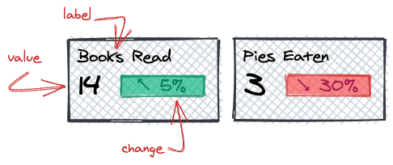

# React Exercises

_A Few small components to exercise your React skills_

## Introduction

Fork and clone this repository to your local machine. Create each of the components listed below. You may add the components to the `App.js` file to view them.

Run the tests with the command

```bash
npm test
```

You have met all requirements when all the tests are passing.

### Stats

Implement a `Stats` component that accepts the following props:

- **label** a string, required
- **value** a number, required
- **change** a number, default to 0



Style is not important, but display positive and negative change differently. Use the characters &#8598; and &#8600; respectively.

Display the absolute value of the change, the colour and the arrow will indicate if it was a positive or negative change.

## Solutions

Reference solutions are provided on the Solutions branch of this repository.

```bash
git checkout Solutions
```

## LICENSE

This is [MIT Licensed](LICENSE)
